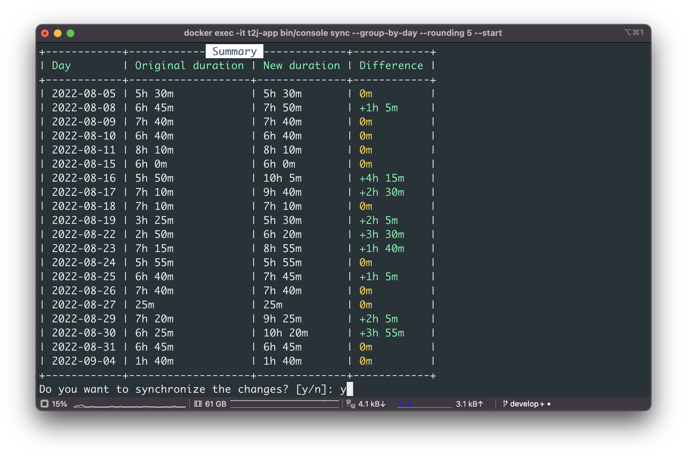

<h1 align="center">Toggl to Jira</h1>

<p align="center">Console application for synchronizing time entries from Toggl into Jira.</p>



## Usage

To synchronize your Toggl entries into Jira simply run:

```bash
$ docker run --rm \
    -e TOGGL_API_TOKEN=<toggl_api_token> \
    -e JIRA_API_TOKEN=<jira_api_token> \
    -e JIRA_WEBSITE_URL=<jira_website_url> \
    -e JIRA_USERNAME=<jira_username> \
    68publishers/toggl-to-jira:latest \
    bin/console sync \
    --no-interaction
```

By default, all yesterday's time entries will be synchronized. Check [available options](#available-options) for further details.

## Getting Started

Please follow these instructions to get a local copy and set it up.

### System Requirements

- Git
- Docker
- Make

### Installation

1. Clone the repository and install the application

```sh
$ git clone https://github.com/68publishers/toggl-to-jira.git
$ cd toggl-to-jira
$ make
```

2. Open the `.env` file and set up your credentials

| Variable           | Type    | Description                           |
|--------------------|---------|---------------------------------------|
| `APP_DEBUG`        | Boolean | Enables debug mode for Tracy          |
| `TOGGL_API_TOKEN`  | String  | Auth token for your Toggl account     |
| `JIRA_USERNAME`    | String  | Username (email) of your Jira account |
| `JIRA_API_TOKEN`   | String  | Auth token for your Jira account      |
| `JIRA_WEBSITE_URL` | String  | URL of your Jira website              |

## Synchronization

Synchronization is started with:

```sh
$ docker exec -it t2j-app bin/console sync --start <START_DATE> --end <END_DATE> [--group-by-day] [--rounding <ROUNDING>] [--filter <FILTER_NAME=FILTER_VALUE>] [--dry-run] [--no-interaction]
```

## Available Options

| Option                   | Type    | Description                                                                                                                                                                                                       |
|--------------------------|---------|-------------------------------------------------------------------------------------------------------------------------------------------------------------------------------------------------------------------|
| `--start`                | String  | Accepts datetime strings - absolute or relative, default: `yesterday`                                                                                                                                             |
| `--end`                  | String  | Accepts datetime strings - absolute or relative, default: `yesterday`                                                                                                                                             |
| `--group-by-day`         | Boolean | Group all daily entries into one (per issue)                                                                                                                                                                      |
| `--append`               | Boolean | All entries will be added without creating a diff. Will cause duplicates if the command is run multiple times on the same day                                                                                     |
| `--rounding`             | Integer | All entries will be rounded to up the given minutes [2-60]                                                                                                                                                        |
| `--filter`               | String  | Filter in the format "filterName=filterValue" that entries must meet for synchronization. Multiple values can be declared, between filters with the same name is OR, between filters with different names is AND. |
| `--dry-run`              | Boolean | Displays only change set and summary tables but do not synchronize anything                                                                                                                                       |
| `-n`, `--no-interaction` | Boolean | Do not ask any interactive question, suitable for scheduled commands, etc.                                                                                                                                        |

## Description format

Descriptions of time entries in Toggl must follow the following pattern:

```
<IssueCode> [<IssueName>] [<Comment>]
```

For example, if the issue in Jira has code `PROJ-123` and the name of the issue is `UX improvements` then the following examples are acceptable:

- `PROJ-123` - the entry is imported with an empty comment
- `PROJ-123 UX improvements` - the entry is imported with an empty comment
- `PROJ-123 UX improvements Fixed footer on small devices` - the entry is imported with a comment `Fixed footer on small devices`
- `PROJ-123 Fixed footer on small devices` - the entry is imported with a comment `Fixed footer on small devices`

## Supported filters

- `issueCode`
- `workspaceId`
- `workspaceName`
- `projectId`
- `projectName`

### Filters example

Entries must be in the project "Demo" or "Demo2":
```
--filter "projectName=Demo" --filter="projectName=Demo2"
```

Entries must be in the workspace "My company" and must have the issue code "PROJ-123":
```
--filter "workspaceName=My company" --filter="issueCode=PROJ-123"
```

## Limitations

Depending on the range of the synchronization interval (start/end), you may run into the limits of one of the APIs. Therefore, we recommend running synchronization e.g. every day/sprint/month, etc.

## Featured
See the [How to Sync Toggl Entries to Jira](https://advanced-developer.medium.com/how-to-sync-toggl-entries-to-jira-7184fd451b40) article on Medium.

## License

The package is distributed under the MIT License. See [LICENSE](LICENSE.md) for more information.
